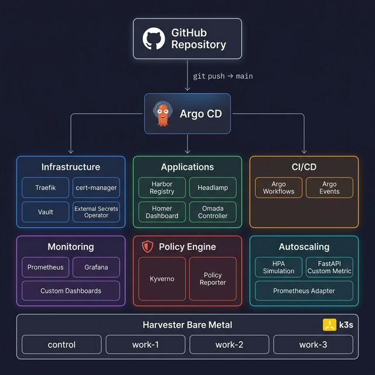

# harvester

This repo contains the declarative GitOps infrastructure for a bare-metal homelab running on Harvester, k3s, and Argo CD.

---

## Architecture Overview



### Directory Structure

| Directory | Purpose |
|-----------|---------|
| `argo/argocd/applications/` | Argo CD Application manifests (managed by app-of-apps) |
| `argo/extras/` | Argo Workflows templates, EventSources, Sensors |
| `ingress/routes/` | Traefik IngressRoutes for all services |
| `ingress/services/` | StatefulSets and Deployments (e.g. Omada) |
| `ingress/homer/` | Homer dashboard ConfigMap, Deployment, Service |
| `ingress/external-secrets/` | ExternalSecret manifests (Vault → K8s Secrets) |
| `monitoring/dashboards/` | Grafana dashboard ConfigMaps |
| `monitoring/` | Prometheus stack and adapter Helm values |
| `kyverno/policies/` | Kyverno ClusterPolicies (Audit mode) |
| `scaling/base/` | HPA simulation Deployment, HPA, Service, PodMonitor |
| `cloud-init/` | VM cloud-init scripts |
| `ansible/` | Ansible playbooks for initial provisioning |

---

## Bootstrap — App of Apps

All Argo CD Applications are managed by a single **app-of-apps** root Application. After initial cluster setup, this is the only manual step required:

```bash
kubectl apply -f argo/argocd/applications/app-of-apps.yaml
```

This watches `argo/argocd/applications/` and automatically deploys every Application manifest found there. Any new YAML pushed to that directory is auto-synced; any deleted YAML is pruned.

### Managed Applications

| Application | Chart / Source | Namespace |
|-------------|---------------|-----------|
| Harbor | `helm.goharbor.io/harbor` | `homelab` |
| Headlamp | `kubernetes-sigs.github.io/headlamp` | `homelab` |
| Kyverno | `kyverno.github.io/kyverno` | `kyverno` |
| Kyverno Policies | `harvester.git → kyverno/policies/` | `kyverno` |
| Policy Reporter | `kyverno.github.io/policy-reporter` | `kyverno` |
| HPA Simulation | `harvester.git → scaling/base/` | `harvester-autoscaling-sim` |
| Grafana Dashboards | `harvester.git → monitoring/dashboards/` | `monitoring` |
| kube-prometheus-stack | `prometheus-community` | `monitoring` |
| cert-manager | `jetstack` | `cert-manager` |
| Argo Workflows | `argoproj.github.io/argo-helm` | `argo` |
| Argo Events | `argoproj.github.io/argo-helm` | `argo` |
| Ingress Stack | `harvester.git → ingress/` | various |

---

## Services & Ingress

All services are exposed via Traefik IngressRoutes with TLS (`home-kenchlightyear-tls`).

| Service | URL | Source |
|---------|-----|--------|
| Homer (dashboard) | `home.kenchlightyear.com` | `ingress/routes/homer-ingressroute.yaml` |
| Grafana | `grafana.home.kenchlightyear.com` | `ingress/routes/grafana-ingressroute.yaml` |
| Harbor | `registry.home.kenchlightyear.com` | `ingress/routes/harbor-ingressroute.yaml` |
| Argo CD | `argocd.home.kenchlightyear.com` | `ingress/routes/argo-ingressroute.yaml` |
| Argo Workflows | `argo.home.kenchlightyear.com` | `ingress/routes/argo-events-ingressroute.yaml` |
| Headlamp | `headlamp.home.kenchlightyear.com` | `ingress/routes/headlamp-ingressroute.yaml` |
| Vault | `vault.home.kenchlightyear.com` | `ingress/routes/vault-ingressroute.yaml` |
| Omada | `omada.home.kenchlightyear.com` | `ingress/routes/omada-ingressroute.yaml` |
| Kyverno (Policy Reporter) | `kyverno.home.kenchlightyear.com` | `ingress/routes/kyverno-ingressroute.yaml` |

---

## Secrets Management

Secrets are managed via **HashiCorp Vault** + **External Secrets Operator**. ExternalSecrets in `ingress/external-secrets/` sync Vault paths into Kubernetes Secrets automatically.

| Secret | Vault Path | Namespace |
|--------|-----------|-----------|
| Grafana admin credentials | `monitoring/grafana` | `monitoring` |
| Harbor admin password | Via Helm | `homelab` |
| Harbor pull secret | Via ExternalSecret | `homelab` |
| Headlamp token | `headlamp` | `homelab` |
| Cloudflare API token | Via ExternalSecret | `cert-manager` |
| Argo Workflows UI token | `homelab/argocd/workflow` | `argo` |

### Argo Workflows UI Token (one-time setup)

The Argo Workflows UI uses a **non-expiring** ServiceAccount token stored in Vault. After first deployment, run once:

```bash
# Extract the permanent SA token
TOKEN=$(kubectl get secret argo-workflows-ui-sa-token -n argo -o jsonpath='{.data.token}' | base64 -d)

# Store it in Vault
vault kv put homelab/argocd/workflow token="$TOKEN"
```

The ExternalSecret refreshes every 1h, syncing the permanent token from Vault into the cluster.

---

## Monitoring

The monitoring stack uses **kube-prometheus-stack** (Prometheus + Grafana) with **prometheus-adapter** for custom HPA metrics.

### Grafana Dashboards

Dashboards are deployed as ConfigMaps with label `grafana_dashboard: "1"` in `monitoring/dashboards/`:

| Dashboard | File |
|-----------|------|
| Harvester HPA Simulation | `hpa-dashboard.yaml` |
| Harvester Autoscaling Sim | `autoscaling-sim-dashboard.yaml` |

---

## Kyverno — Policy Engine

Kyverno is deployed in **Audit mode** — all policies log violations without blocking any traffic. Policies live in `kyverno/policies/` and are synced by Argo CD.

### Active Policies

| Policy | Severity | What it audits |
|--------|----------|---------------|
| `require-resource-limits` | Medium | Pods without CPU/memory limits |
| `disallow-latest-tag` | Medium | Containers using `:latest` tag |
| `require-labels` | Low | Deployments/StatefulSets missing `app` label |
| `disallow-privileged` | High | Privileged containers |
| `require-readonly-rootfs` | Low | Containers without `readOnlyRootFilesystem` |

View violations: `kubectl get policyreport -A` or browse the Policy Reporter UI at `kyverno.home.kenchlightyear.com`.

To switch a policy to enforcing mode, change `validationFailureAction: Audit` to `Enforce` in the policy YAML.

### Known Issue — CRD Installation

Kyverno's core CRDs (`clusterpolicies.kyverno.io`, `policies.kyverno.io`) exceed 1MB and ArgoCD may silently fail to install them. If the Kyverno pod crashes with `"CRDs not installed"`, apply them manually:

```bash
helm repo add kyverno https://kyverno.github.io/kyverno/
helm template kyverno kyverno/kyverno --version 2.7.5 --include-crds | kubectl apply --server-side -f -
kubectl rollout restart deployment kyverno -n kyverno
```

This only needs to be done **once** — after the CRDs exist, ArgoCD manages everything normally.

---

## Related Repositories

| Repository | Description |
|------------|-------------|
| [joebertj/hpa-app](https://github.com/joebertj/hpa-app) | FastAPI application that emits the `simulated_user_load` custom Prometheus metric for HPA scaling demos |
| [joebertj/omada](https://github.com/joebertj/omada) | TP-Link Omada Controller containerized for Kubernetes — the first production-grade Kubernetes deployment of Omada, running as a StatefulSet with WireGuard VPN and node affinity |

---

## HPA Simulation — Custom Metric Autoscaling Demo

This demo simulates Kubernetes **Horizontal Pod Autoscaling (HPA)** using a custom `simulated_user_load` Prometheus metric from the [hpa-app](https://github.com/joebertj/hpa-app).

> **Note:** This is now managed by Argo CD via the `hpa-simulation` Application. No manual `kubectl apply` needed — just push to `main`.

### How the metric works

The FastAPI app emits a `simulated_user_load` Prometheus gauge that oscillates using a Poisson distribution. The HPA scales based on average value per pod:

- Target: `averageValue: 100000`
- Replicas range: `1–9`
- Scale-down stabilization: `5s` (fast for demo purposes)

### Managed Files

| File | Description |
|---|---|
| `scaling/base/hpa-common.yaml` | Namespace, Service, HPA, PodMonitor |
| `scaling/base/hpa-deployment-base.yaml` | Deployment with `topologySpreadConstraints` |

### CI/CD Pipeline

The Argo Workflows CI pipeline (`argo/hpa-app-workflow-template.yaml`) automatically:
1. Builds the FastAPI image via Kaniko
2. Pushes to Harbor (`registry.home.kenchlightyear.com/library/scaling-fastapi`)
3. Patches the Deployment with the new image tag

Argo CD is configured to ignore image tag and replica count changes made by the workflow and HPA respectively.

### Observe

```bash
# Watch HPA calculate desired replicas
kubectl get hpa -n harvester-autoscaling-sim -w

# Watch pod scheduling
kubectl get pods -n harvester-autoscaling-sim -w
```
